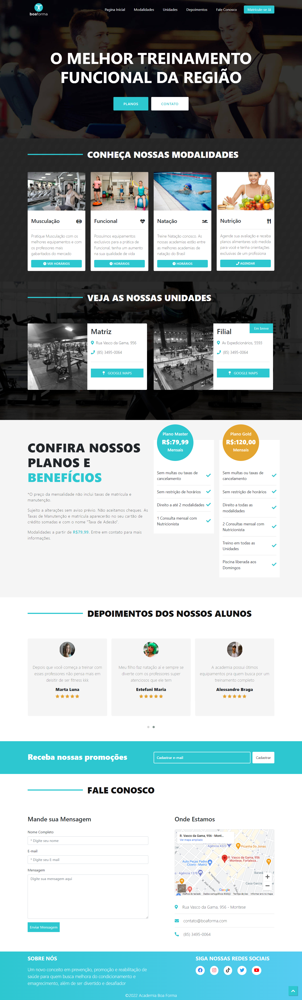

<div align ="center">

# Projeto Academia Boa Forma

</div>

Esse é um projeto de site institucional para uma academia, cujo o objetivo era mostrar informações sobre modalidades, horários, valores e localização da academia. Nesse projeto eu utilizo Boostrap 5, SASS e Javascript, para tornar o projeto responsivo eu utilizei Media Queries.

* Demo: [Clique aqui para ver esse projeto](https://leandrorafaeel.github.io/projeto-academia)


## Desktop:
<div align="left">
    
</div>

## Tecnologias:
Esse projeto foi desenvolvido com as seguintes tecnologias:

* HTML5
* SASS
* Bootstrap 5
* JAVASCRIPT
* JQUERY
* OWL CAROUSEL

## Dependências:
Ferramentas que utilizei nesse projeto:

* [Bootstrap 5](https://getbootstrap.com/)
* [SASS](https://sass-lang.com/)
* [JQUERY](https://releases.jquery.com/jquery/)
* [OWL CAROUSEL](https://owlcarousel2.github.io/OwlCarousel2/index.html)


## Como usar:
Clone o repositório abaixo
```
git clone https://github.com/leandrorafaeel/projeto-academia
```

## Author: 
 

#### Leandro Rafael

[](https://www.linkedin.com/in/leandrorafael-dev/) [](https://twitter.com/leandrorafaelBR) 

## Licença:
[](https://opensource.org/licenses/MIT)

Este projeto está sob licença do MIT. Veja a licença para mais informações:

[Ver Copyright](https://github.com/leandrorafaeel/projeto-academia/blob/master/LICENSE)